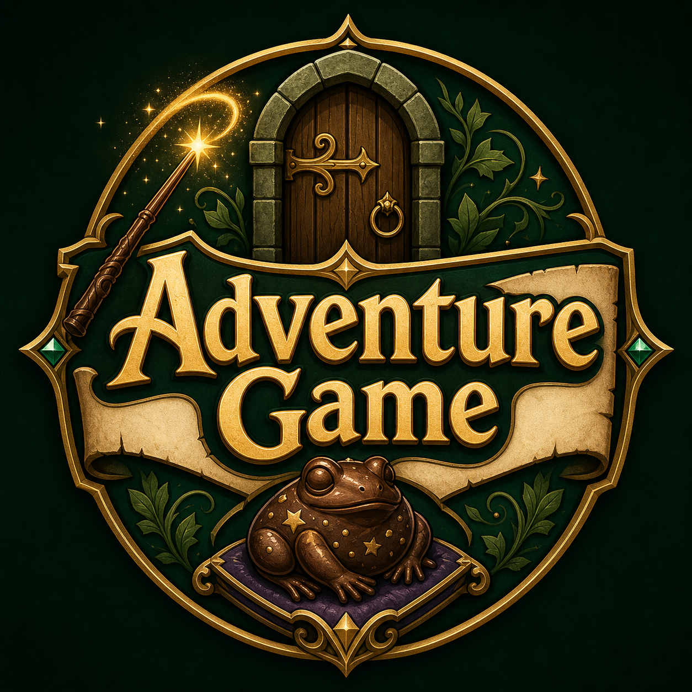

Adventure Game
==============

<p align="center">
  
</p>

This `Web-Port` branch contains the current modular Python game plus an HTML5
terminal-style browser port:

- `main.py` runs the reorganized text adventure.
- `text_adventure/` contains the readable modular Python game code.
- `index.html` runs the browser version.
- `web/` contains the browser version's CSS and JavaScript.
- The older one-file version lives on the `legacy` git branch.

Run the Python text game:

```bash
python3 main.py
```

Run the HTML5 web port locally:

```bash
python3 -m http.server 4173
```

Then open:

```text
http://127.0.0.1:4173/
```

In the web version, numbered menu rows and combat spell rows can be clicked.
Typing the number, command, or spell still works too.

To host it at `lordfunion.dev/adventure-game`, upload these from the
`Web-Port` branch into `public_html/adventure-game/`:

- `index.html`
- `web/`

The game now creates encrypted checkpoint saves in `saves/`. Checkpoints appear
between story scenes, and the main menu can load existing `.tasave` files.

Load a save directly:

```bash
python3 main.py saves/autosave.tasave
```

Save files are encrypted and signed with a tamper check, so editing money,
health, inventory, or spells in the file will make the save fail to load. This
blocks normal save-file cheating. A fully cheat-proof game would need a trusted
server because local game code can always be modified by the player.

Cloud saves are optional. The game still writes local `.tasave` files first, and
local loading still works when the web API is offline. Use **Cloud Saves** from
the main menu or checkpoint menu to create an account, sign in, upload the
current checkpoint, or download a cloud save. The game uses
`https://lordfunion.dev/adventure-api` by default.

GoDaddy API setup:

1. Create the database and database user in cPanel.
2. Give the database user **ALL PRIVILEGES** on the database.
3. Open phpMyAdmin, select the database, and run `server/adventure-api/schema.sql`
   once to create the tables.
4. Copy `server/adventure-api/config.example.php` to `config.php` and fill in
   the real cPanel database values.
5. Upload `index.php` and `config.php` to `public_html/adventure-api/`.

Optional pacing control:

```bash
TEXT_ADVENTURE_SPEED=fast python3 main.py
TEXT_ADVENTURE_SPEED=instant python3 main.py
```

Use the legacy branch:

```bash
git switch legacy
python3 main.py
git switch main
```
